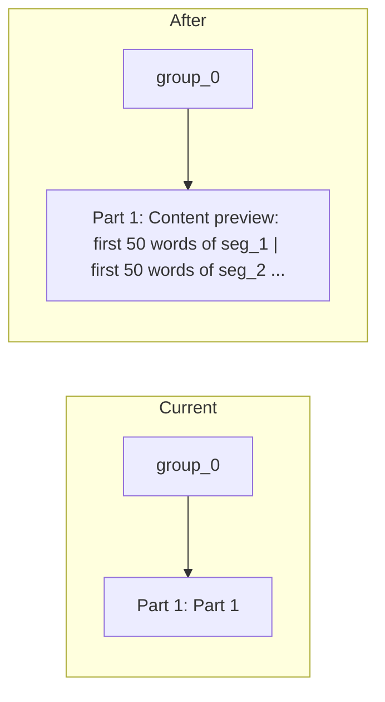

# ToT parent display using raw content only (no summaries)

## Problem

At root, ToT sees group nodes as `[group_0] Part 1: Part 1`. Those nodes have no body content, so the model has no signal and declares a dead end. Using any "summary" (even extractive) for display still leaves room for concern: if summaries were ever LLM-generated elsewhere, we would be feeding the LLM something it could have hallucinated. The safest approach is to **never use a summary field** for this signal — only show **raw document content**.

## Approach: show raw content snippets only

When formatting a child for the ToT prompt, if that child is an **internal node** (has `child_ids`) and its own summary is trivial (empty or equals header), **do not** use the skeleton's summary field. Instead, for each of its children, fetch **full content** from the existing KV store (`kv_store.get(child_id)`), take the **first N words** of that raw string in the formatting layer, and show that as a "Content preview:" for the group. No LLM is involved in creating that text; no summary field is read. We are literally slicing the stored document and showing it to ToT.

## Implementation

**1. Formatting in the graph (ToT prompt) using kv_store only**

- **File:** `rnsr/agent/graph.py`
- **Change:** Add a helper that, given `(skeleton, node, kv_store)`, returns the string to show for that node in the "Children Nodes" list:
  - If `node` has no `child_ids`, or has a non-trivial summary (length > 20 and not equal to header), use current behavior: `[node_id] header: summary`.
  - Else (internal node with trivial/empty summary): if `kv_store` is available, for each `child_id` in `node.child_ids` (cap at e.g. 5 children to keep prompt size bounded), get `content = kv_store.get(child_id) or ""`, take the **first 50 words** of `content` (split and rejoin), and join these snippets with `|`. Prefix with "Content preview: " so it is explicit this is verbatim document text. Cap total length (e.g. 500 chars) for the whole preview. If `kv_store` is None, keep current trivial display.
- **Use it in** `_format_children_summaries`: pass `kv_store` into the formatter (add an optional `kv_store` argument to `_format_children_summaries`). When building each line for a child, call this helper. `evaluate_children_with_tot` already receives `kv_store`; pass it through to `_format_children_summaries`.

**2. Define "trivial" summary**

- Consider a node's summary trivial if it is empty, or length < 20, or it equals the node's header (case-insensitive). Only then do we substitute the content preview.

**3. No use of summary field for this path**

- For internal nodes with trivial summary, we do **not** read `skeleton[child_id].summary`. We only read `kv_store.get(child_id)` and slice words. So no "summary" is involved; no LLM can have produced the text we show.

## Result

- At root, ToT sees lines like: `[group_0] Part 1: Content preview: <first 50 words of seg_1 raw content> | <first 50 words of seg_2 raw content> ...`.
- Zero reliance on any summary; zero chance of feeding the LLM hallucinated summaries. Only raw document slices.

## Optional follow-up

- Cap number of children included (e.g. 5) and total preview length so the ToT prompt stays bounded.

